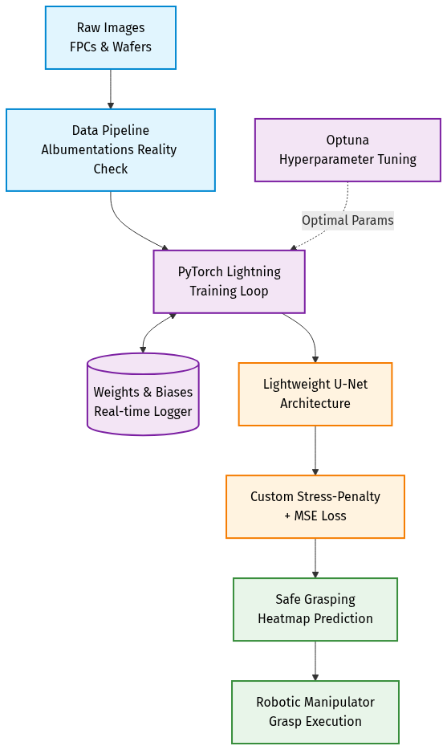

# 🦾 Predictive Vision & MLOps Pipeline for Flexible Micro-Electronics


An end-to-end Machine Learning pipeline designed to enable robotic manipulators to safely handle highly deformable and fragile materials, specifically **Flexible Printed Circuits (FPCs)** and **Ultra-thin Semiconductor Wafers**. 

Unlike standard rigid object grasping, handling these materials requires predicting physical stress to avoid micro-cracking. This pipeline automates the training workflow, simulates physical edge cases (warpage, extreme reflection), and outputs a **Safe Grasping Heatmap**.

## 🏗️ Architecture & Workflow



## ✨ Key Features

- 🏗️ **Stress-Aware Heatmap Prediction**: Uses a lightweight U-Net architecture to predict pixel-level safe grasping zones instead of traditional bounding boxes.
- 🌪️ **Robust Data Pipeline (The "Reality Check")**: Integrates `albumentations` to heavily augment training data, simulating factory lighting (flares, glare), material warpage (`ElasticTransform`, `GridDistortion`), and robotic arm motion blur.
- ⚖️ **Custom Stress-Penalty Loss**: A tailored loss function (`MSELoss` + `StressPenaltyLoss`) that heavily penalizes the model for predicting safe grasp points on critical IC areas or high-stress edges.
- 🚀 **Automated MLOps Lifecycle**: Built with `pytorch-lightning` to eliminate boilerplate and integrated with **Weights & Biases (W&B)** for real-time tracking of loss curves and predicted heatmaps.
- 🎛️ **Hyperparameter Optimization (HPO)**: Includes an automated **Optuna** study with early pruning to find the optimal learning rate, batch size, and weight decay.

## 📂 Repository Structure

```text
deformable-grasp-vision/
├── configs/                 # YAML configuration (Hyperparameters, model settings)
│   └── train_config.yaml    
├── data/                    
│   ├── raw/                 # Put your real images here
│   └── processed/           
├── src/                     
│   ├── data_pipeline/       # Dataset loaders & Albumentations reality-sim
│   ├── models/              # U-Net PyTorch architecture
│   ├── utils/               # Custom Metrics & W&B Logger helpers
│   └── train.py             # Main PyTorch Lightning training loop
├── scripts/                 
│   └── hpo_optuna.py        # Automated hyperparameter tuning script
└── requirements.txt
```

## 🚀 Getting Started

### 1. Installation
Clone the repository and install the dependencies:
```bash
git clone https://github.com/Jabtwin/Predictive-Vision-MLOps-Pipeline-for-Flexible-Micro-Electronics.git
cd deformable-grasp-vision
pip install -r requirements.txt
```

### 2. Mock Training Run
You can verify the pipeline end-to-end using the built-in mock dataset generator (no real data required):
```bash
python src/train.py
```

### 3. Hyperparameter Tuning
To automatically search for the best model parameters using Optuna:
```bash
python scripts/hpo_optuna.py
```

## 📊 Logging & Tracking
The training script automatically initializes a Weights & Biases logger. Ensure you have an account and are logged in (`wandb login`) to view real-time validation heatmaps and training curves.
